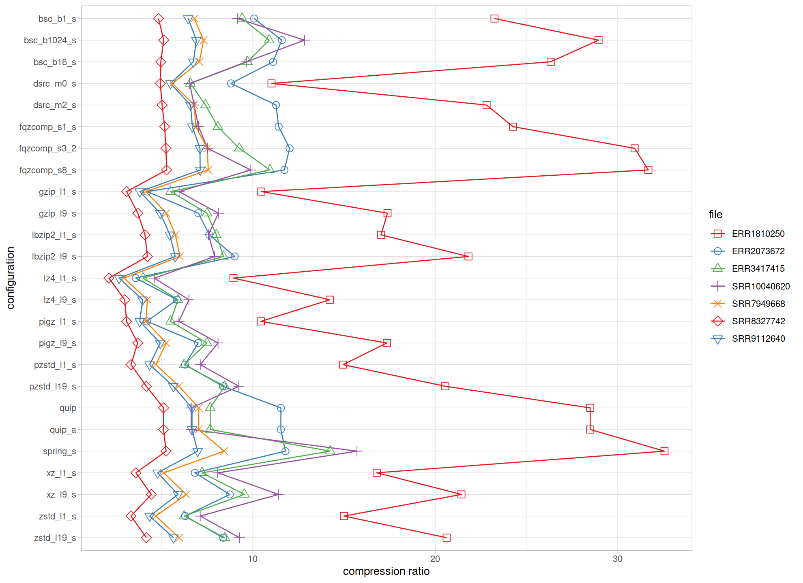
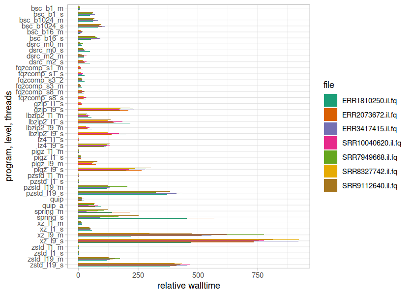
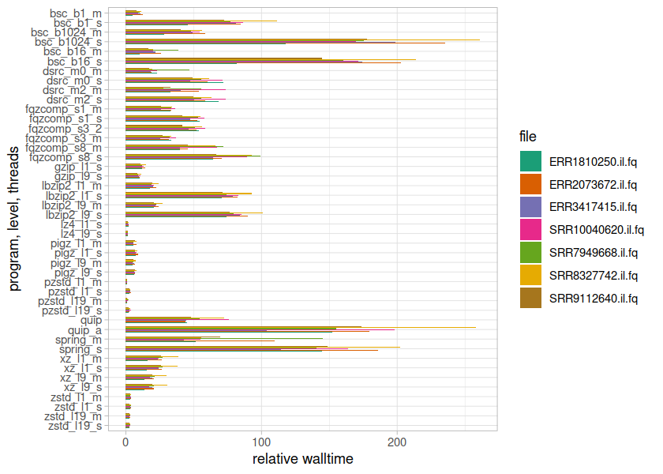
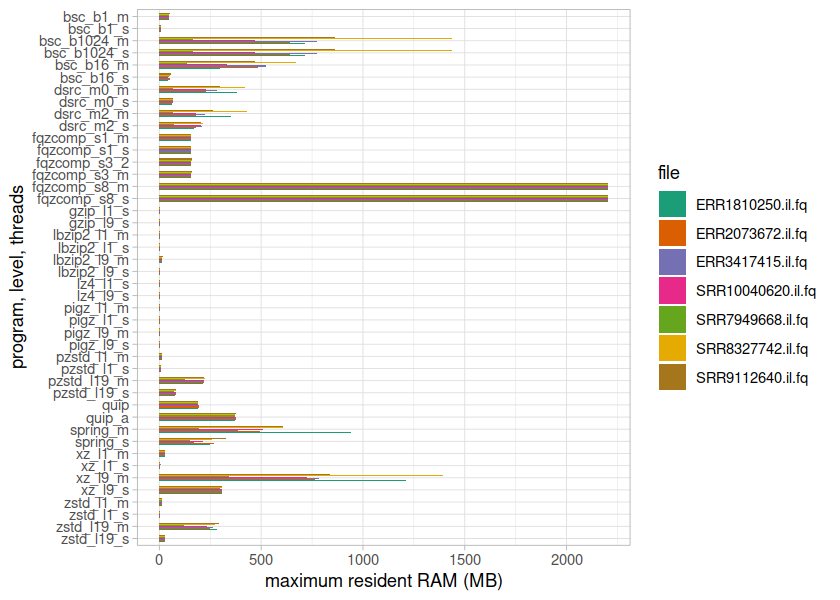

= Optimal compression scheme to balance ratio and decompression speed
Jeremy Volkening
:source-highlighter: pygments

[abstract]
.Abstract
Some resources spent most of their time in storage but also require quick access when needed.
For these resources, compression speed is of little importance, as they are write-once-read-often objects.
We tested a number of popular compression tools to look for one which provided fast decompression with reasonable file sizes.

== Methods

Three input files were used for testing, each truncated to ~ 2GB in size:

f1.input:: A file of randomly chosen English words

f2.input:: The *Mus musculus* genome

f3.input:: A prebuilt https://ccb.jhu.edu/software/centrifuge/[Centrifuge] index file

Tests were run using AWS Batch, with one or four threads per process.
For all programs, default parameters were used except for compression level and threads, which were set as indicated below.

=== Software versions

[%header,cols="2*^",format=tsv]
|===
include::versions.tsv[]
|===

== Results

=== Compression ratio

.Compressed/uncompressed file size ratio relative to best ratio (lower is better)

=== (De)compression speed

.Compression walltime relative to fastest time (lower is better)

.Decompression walltime relative to fastest time (lower is better)

=== Memory usage

.Compression maximum resident memory relative to smallest value (lower is better)

.Decompression maximum resident memory relative to smallest value (lower is better)

=== CPU usage

.Compression average CPU utilization

.Decompression average CPU utilization

