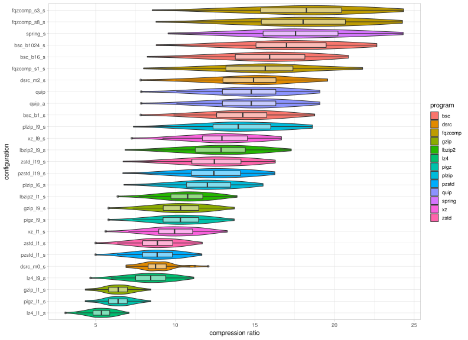
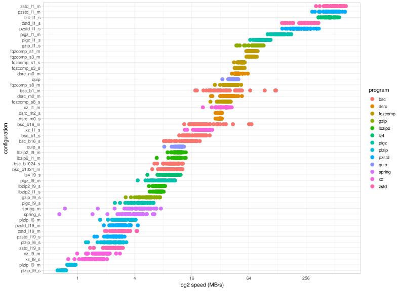

= Optimal compression scheme to balance ratio and decompression speed
Jeremy Volkening
:source-highlighter: pygments

[abstract]
.Abstract
Some resources spent most of their time in storage but also require quick access when needed.
For these resources, compression speed is of little importance, as they are write-once-read-often objects.
We tested a number of popular compression tools to look for one which provided fast decompression with reasonable file sizes.

== Methods

A variety of paired-end Illumina FASTQ datasets were used as input (TODO: finish description).

=== Software versions

[%header,cols="2*^",format=tsv]
|===
include::versions.tsv[]
|===

== Results

=== Compression ratio

.Compression ratio (higher is better)

.Ratio of compressed files with Q8 binning (unbinned:binned, higher is better)

=== (De)compression speed

.Compression rate (MB/s) (higher is better)

.Decompression rate (MB/s) (higher is better)

=== Memory usage

.Compression maximum resident memory

.Decompression maximum resident memory

=== CPU usage

.Compression average CPU utilization

.Decompression average CPU utilization

